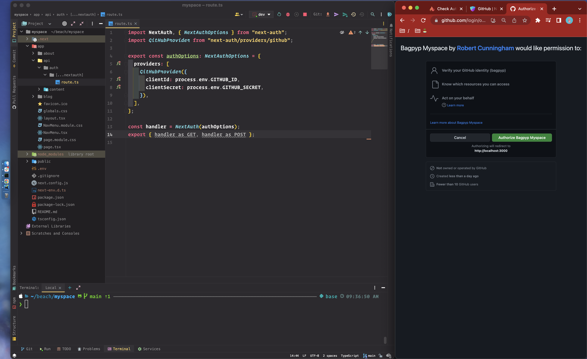

# Myspace

This is a [Next.js](https://nextjs.org/) project

NavMenu in the RootLayout is a server-generated component 
that will contain client-components as leaves  


One of them is a sign-in button that directs 
the user to authenticate with GitHub  


Once the user is authenticated, their avatar 
from GitHub is used to identify them in the app


By integrating with neonDb (some postgres shit) 
by way of prisma, we're able to store user session data 
with a one-liner in a config option


## Contribute

Clone the repo down and fill your .env file
```
GITHUB_ID=
GITHUB_SECRET=
NEXTAUTH_SECRET=
DATABASE_URL=
SHADOW_DATABASE_URL=
```

Then, run the development server with
```bash
npm run dev
```

When you're up and running, open  
[http://localhost:3000](http://localhost:3000) 
in your browser 😎
